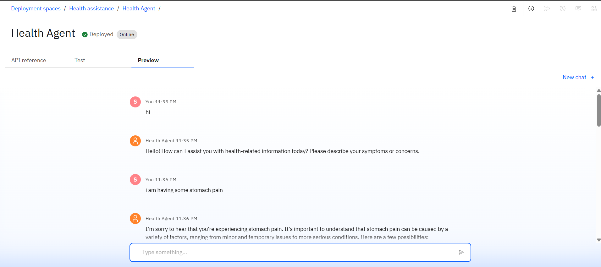
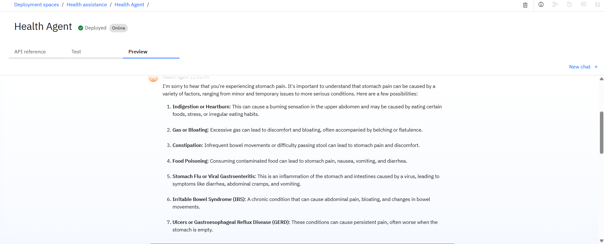
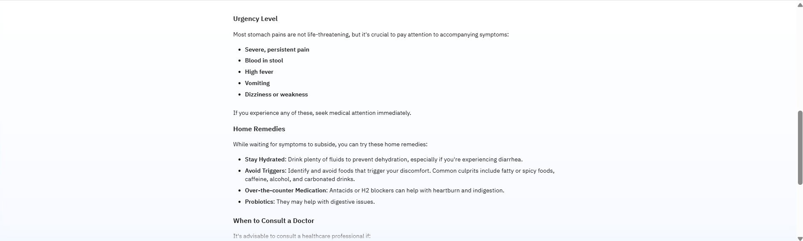

<h1>Agentic AI Health Symptom Checker <h1>

<pr>
<h2>Problem Statement<h2>
<h4>The Challenge – An Agentic AI Health Symptom Checker helps users understand their health conditions by analyzing symptoms and providing probable causes, preventive advice, and care recommendations. It retrieves verified medical data, symptom databases, and guidelines from trusted sources like WHO, government health portals, and medical journals.
<h4>
</pr>

<pr>
<h2>Proposed Solution<h2>
<pr><ol>
<li>System Architecture: How the AI system would be structured (e.g., front-end user interface, back-end AI engine, database integration).</li>
<li>Key Features: A detailed breakdown of the functionalities the checker would offer (e.g., symptom input, probable cause analysis, preventive advice, care recommendations, integration with telehealth).</li>
<li>Technology Stack: The specific technologies and tools that would be used (e.g., Python for AI, specific ML/NLP libraries, cloud platforms, database systems).</li>
<li>Data Sources and Integration: How verified medical data from sources like WHO, government health portals, and medical journals would be ingested and kept up-to-date.</li>
<li>User Experience (UX) Design: How the user interface would be intuitive and user-friendly.
</li></ol></pr>
</pr>

<pr><h2>System approach<h2>
<ol><li>Set up the sandbox by creating the new project</li>
<li>Giving the storage for the Model</li>
<li>Associating the watsonx runtime server</li>
<li>Setup the agentic Ai build</li>
<li>Providing the instruction to the Agent</li>
<li>Selecting the model here the model selected is granite-3-3-8b-instruct</li>
<li>After the model selected tune the model parameters that is frequency, seeds, tokens</li>
<li>After the model is tested successfully create the new deployment space</li>
<li>After creating the deployment space deploy the model</li></ol>
</pr>

<h1>MODEL USED <h1>
<pr></pr>

<pr><h1> Results <h1>

</pr>

